# Flowchart — Patungan Kafe (Split Bill)

Flowchart program `patungan_kafe.c`, digambar gaya Miro:
bentuk membulat, warna per kategori tahap, panah jelas, dan label keputusan singkat.

```mermaid
flowchart TD
    classDef startEnd fill:#12B886,stroke:#0B7A55,stroke-width:2px,color:#FFFFFF
    classDef io fill:#7950F2,stroke:#5936C4,stroke-width:2px,color:#FFFFFF
    classDef process fill:#339AF0,stroke:#1971C2,stroke-width:2px,color:#FFFFFF
    classDef decision fill:#FFD43B,stroke:#E67700,stroke-width:2px,color:#212529
    classDef output fill:#F06595,stroke:#C2255C,stroke-width:2px,color:#FFFFFF

    START([MULAI]):::startEnd

    subgraph S1["1. Input Peserta"]
        A1["Tampilkan banner<br/>'=== PATUNGAN KAFE ==='"]:::output
        A2[/"Input jumlah orang<br/>1 - 10"/]:::io
        A3{"Jumlah angka<br/>dan 1-10?"}:::decision
        A4["Tampilkan error<br/>'Masukkan angka!' / 'Antara 1-10!'"]:::output
        A5["i = 0"]:::process
        A6[/"Input nama orang ke-(i+1)"/]:::io
        A7{"Nama kosong<br/>atau EOF?"}:::decision
        A8["Isi nama default:<br/>'Teman' / 'Teman-i+1'"]:::process
        A9[/"Input belanja orang ke-i<br/>(Rp)"/]:::io
        A10{"Angka dan<br/>>= 0?"}:::decision
        A11["Tampilkan error<br/>'Masukkan angka!' / 'Tidak boleh minus!'"]:::output
        A12{"i + 1 < jumlah<br/>orang?"}:::decision
    end

    subgraph S2["2. Total Belanja"]
        B1["total = sum of<br/>semua belanja"]:::process
        B2{"total <= 0?"}:::decision
        B3["Tampilkan<br/>'Total Rp 0, selesai.'"]:::output
        B4["Tampilkan<br/>'Total semuanya: Rp total'"]:::output
    end

    subgraph S3["3. Input Pajak"]
        C1[/"Input pajak %<br/>0 - 100"/]:::io
        C2{"Angka dan<br/>0-100?"}:::decision
        C3["Tampilkan error<br/>'Masukkan angka!' / 'Harus 0-100!'"]:::output
        C4["rpPajak = total x % / 100<br/>totalPajak = total + rpPajak"]:::process
        C5["Tampilkan pajak,<br/>lalu total + pajak"]:::output
    end

    subgraph S4["4. Split Bill + Pembulatan"]
        D1["i = 0"]:::process
        D2["adil = belanja_i<br/>+ belanja_i / total x rpPajak"]:::process
        D3["harusBayar_i =<br/>bulatRibuan(adil)"]:::process
        D4["Tampilkan baris struk<br/>'nama: Rp X + pajak -> bayar Rp Y'"]:::output
        D5{"i + 1 < jumlah<br/>orang?"}:::decision
    end

    subgraph S5["Fungsi: bulatRibuan"]
        E1["n = int(nominal)"]:::process
        E2{"nominal > n?"}:::decision
        E3["n = n + 1<br/>kenaikan pecahan"]:::process
        E4{"n habis dibagi<br/>1000?"}:::decision
        E5["return n<br/>(sudah bulat)"]:::process
        E6["return (n/1000 + 1) x 1000<br/>dibulatkan ke atas"]:::process
    end

    subgraph S6["5. Struk Transfer"]
        F1["i = 0"]:::process
        F2["Tampilkan<br/>'nama transfer Rp harusBayar_i'"]:::output
        F3{"i + 1 < jumlah<br/>orang?"}:::decision
    end

    END([SELESAI]):::startEnd

    START --> A1 --> A2 --> A3
    A3 -- "tidak valid" --> A4 --> A2
    A3 -- "valid" --> A5 --> A6 --> A7
    A7 -- "ya" --> A8 --> A9
    A7 -- "tidak" --> A9 --> A10
    A10 -- "tidak valid" --> A11 --> A9
    A10 -- "valid" --> A12
    A12 -- "ya" --> A5
    A12 -- "tidak" --> B1

    B1 --> B2
    B2 -- "ya (Rp 0)" --> B3 --> END
    B2 -- "tidak" --> B4 --> C1

    C1 --> C2
    C2 -- "tidak valid" --> C3 --> C1
    C2 -- "valid" --> C4 --> C5 --> D1

    D1 --> D2 --> D3 --> D4 --> D5
    D5 -- "ya" --> D2
    D5 -- "tidak" --> F1

    D3 -.-> E1
    E1 --> E2
    E2 -- "ya" --> E3 --> E4
    E2 -- "tidak" --> E4
    E4 -- "ya" --> E5 -.-> D3
    E4 -- "tidak" --> E6 -.-> D3

    F1 --> F2 --> F3
    F3 -- "ya" --> F2
    F3 -- "tidak" --> END
```

## Legenda Warna

| Warna | Bentuk / Kategori |
|---|---|
| Hijau | Start / End (terminal) |
| Ungu | Input pengguna (I/O) |
| Biru | Proses / perhitungan |
| Kuning | Keputusan (percabangan & validasi) |
| Merah muda | Output / tampilan layar |
| Garis putus-putus | Pemanggilan fungsi `bulatRibuan` |

## Catatan Alur

1. **Validasi input berulang** — jumlah orang, nama, belanja, dan pajak memakai loop `while (1)` sampai input valid.
2. **Total Rp 0** — program langsung selesai tanpa split bill.
3. **Split proporsional** — tiap orang menanggung pajak sesuai porsi belanjanya:
   `adil = belanja_i + (belanja_i / total) × rpPajak`
4. **Pembulatan ke atas ke ribuan** — fungsi `bulatRibuan()` membulatkan pecahan ke atas, misal Rp 38.500 → Rp 39.000.
5. **Output akhir** — struk split bill per orang, lalu ringkasan transfer.
